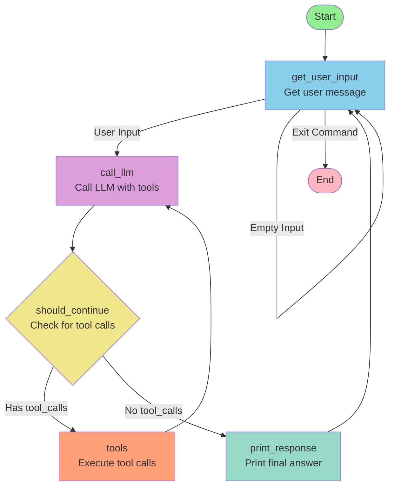

time { python3 llama_mmlu_eval.py ; python3 llama_mmlu_eval2.py }
time { python3 llama_mmlu_eval.py & python3 llama_mmlu_eval2.py }

## Q2-3
client = OpenAI()
response = client.chat.completions.create(
    model="gpt-4o-mini",
    messages=[{"role": "user", "content": "Say: Working!"}],
 max_tokens=5)

the first line will create a client to interact with the server in the cloud.
The second line will submit message to the selected model. And the maximum output token is 5. 

## Q3
============================================================
TEST 1: Query requiring tool
============================================================
User: What's the weather like in San Francisco?

--- Iteration 1 ---
LLM wants to call 1 tool(s)
  Tool: get_weather
  Args: {'location': 'San Francisco'}
  Result: Sunny, 72°F

--- Iteration 2 ---
Assistant: The weather in San Francisco is sunny with a temperature of 72°F.

============================================================
TEST 2: Query not requiring tool
============================================================
User: Say hello!

--- Iteration 1 ---
Assistant: Hello! How can I assist you today?

============================================================
TEST 3: Multiple tool calls
============================================================
User: What's the weather in New York and London?

--- Iteration 1 ---
LLM wants to call 2 tool(s)
  Tool: get_weather
  Args: {'location': 'New York'}
  Result: Cloudy, 55°F
  Tool: get_weather
  Args: {'location': 'London'}
  Result: Rainy, 48°F

--- Iteration 2 ---
Assistant: The weather in New York is cloudy with a temperature of 55°F, while in London, it is rainy with a temperature of 48°F.

## Q4
============================================================
TEST 1: Query requiring tool
============================================================
User: What's the weather like in San Francisco?

--- Iteration 1 ---
LLM wants to call 1 tool(s)
  Tool: get_weather
  Args: {'location': 'San Francisco'}
  Result: Sunny, 72°F

--- Iteration 2 ---
Assistant: The weather in San Francisco is sunny with a temperature of 72°F.

============================================================
TEST 2: Query not requiring tool
============================================================
User: Say hello!

--- Iteration 1 ---
Assistant: Hello! How can I assist you today?

============================================================
TEST 3: Multiple tool calls
============================================================
User: What's the weather in New York and London?

--- Iteration 1 ---
LLM wants to call 2 tool(s)
  Tool: get_weather
  Args: {'location': 'New York'}
  Result: Cloudy, 55°F
  Tool: get_weather
  Args: {'location': 'London'}
  Result: Rainy, 48°F

--- Iteration 2 ---
Assistant: The current weather is as follows:
- **New York:** Cloudy, 55°F
- **London:** Rainy, 48°F

============================================================
TEST 4: Calculator tool
============================================================
User: What's the area of a circle with radius 5?

--- Iteration 1 ---
LLM wants to call 1 tool(s)
  Tool: calculator
  Args: {'geometric_type': 'circle', 'params_list': [5]}
  Result: 78.53981633974483

--- Iteration 2 ---
Assistant: The area of a circle with a radius of 5 is approximately 78.54 square units.

============================================================
TEST 5: Letter counter tool
============================================================
User: How many s are in Mississippi riverboats?

--- Iteration 1 ---
LLM wants to call 1 tool(s)
  Tool: count_letter
  Args: {'text': 'Mississippi riverboats', 'letter': 's'}
  Result: 5

--- Iteration 2 ---
Assistant: There are 5 occurrences of the letter 's' in "Mississippi riverboats."

============================================================
TEST 6: Word statistics tool
============================================================
User: Analyze the text: 'The quick brown fox jumps over the lazy dog. The dog was lazy and the fox was quick.'

--- Iteration 1 ---
LLM wants to call 1 tool(s)
  Tool: word_statistics
  Args: {'text': 'The quick brown fox jumps over the lazy dog. The dog was lazy and the fox was quick.'}
  Result: {"word_count": 18, "character_count": 84, "character_count_no_spaces": 67, "average_word_length": 3.72, "most_common_words": [["the", 4], ["quick", 2], ["fox", 2], ["lazy", 2], ["dog", 2]]}

--- Iteration 2 ---
Assistant: Here are the statistics for the provided text:

- **Word Count:** 18
- **Character Count:** 84
- **Character Count (excluding spaces):** 67
- **Average Word Length:** 3.72
- **Most Common Words:**
  - "the": 4 occurrences
  - "quick": 2 occurrences
  - "fox": 2 occurrences
  - "lazy": 2 occurrences
  - "dog": 2 occurrences

### Q4 Sequential Chaining and 5-Iteration Limit

**Example Query That Hits the Limit:**
A query that requires:
1. Getting weather for a city
2. Analyzing that weather text for statistics
3. Counting specific letters in the text
4. Calculating areas based on those counts
5. Repeating the process for another city
6. And potentially more steps...

This type of query will likely hit the 5-iteration limit because each step depends on the previous one, and the LLM may need multiple iterations to complete all the requested operations.

## Q5: LangGraph Implementation with Checkpointing and Recovery
### Mermaid Diagram

### recover mechanism result
(myenvlab2) druid@MacBookPro lab3 % python langgraph-tool-handling_q5.py 
============================================================
LangGraph Tool-Enabled Agent
============================================================
Type 'exit' or 'quit' to end the conversation
The conversation state is checkpointed and can be recovered.
============================================================

You: hello

[Agent] Processing...

[Assistant]: Hello! How can I assist you today?

You: exit
Goodbye!

[Assistant]: __EXIT__
(myenvlab2) druid@MacBookPro lab3 % python langgraph-tool-handling_q5.py recover conversation-1

============================================================
Recovered Conversation
============================================================
Thread ID: conversation-1
Messages in history: 3

Recent conversation history:
  [User]: hello
  [Assistant]: Hello! How can I assist you today?
============================================================

Continuing conversation...

============================================================
Continuing existing conversation
============================================================
Type 'exit' or 'quit' to end the conversation
The conversation state is checkpointed and can be recovered.
============================================================

You: Is this the first talk?

[Agent] Processing...

[Assistant]: Yes, this is our first conversation! How can I help you today?

You: No 

[Agent] Processing...

[Assistant]: I apologize for the misunderstanding. Can you please clarify what you mean?

You: I mean do you know I have recover from another conversation

[Agent] Processing...

[Assistant]: I see! You’re referring to a previous conversation. I don’t have the ability to recall past interactions, as each conversation is treated independently. How can I assist you based on your previous discussions?

You: exit
Goodbye!

[Assistant]: __EXIT__

(myenvlab2) druid@MacBookPro lab3 % python langgraph-tool-handling_q5.py recover conversation-1

============================================================
Recovered Conversation
============================================================
Thread ID: conversation-1
Messages in history: 9

Recent conversation history:
  [User]: No
  [Assistant]: I apologize for the misunderstanding. Can you please clarify what you mean?
  [User]: I mean do you know I have recover from another conversation
  [Assistant]: I see! You’re referring to a previous conversation. I don’t have the ability to recall past interact
============================================================

Continuing conversation...

============================================================
Continuing existing conversation
============================================================
Type 'exit' or 'quit' to end the conversation
The conversation state is checkpointed and can be recovered.
============================================================

You: Get the weather for San Francisco, then analyze that weather description to get word staistics, count how many 'y' letters are in the weather description, and calculate the area of a circle with radius equal to the word count from the statistics.

[Agent] Processing...
[Agent] Using 1 tool(s): ['get_weather']

[Agent] Processing...
[Agent] Using 3 tool(s): ['word_statistics', 'count_letter', 'calculator']

[Agent] Processing...

[Assistant]: Here's the information you requested for the weather in San Francisco:

1. **Weather Description**: Sunny, 72°F

2. **Word Statistics**:
   - Word Count: 2
   - Character Count: 11
   - Character Count (without spaces): 10
   - Average Word Length: 5.0
   - Most Common Words: 
     - "sunny": 1 occurrence
     - "72°F": 1 occurrence

3. **Count of 'y' Letters**: 1

4. **Area of Circle with Radius 2**: Approximately 12.57 square units.

If you need further assistance or have more questions, feel free to ask!

You: 

## Q6
I think maybe tools can be used simultaneously since some tools are independent.